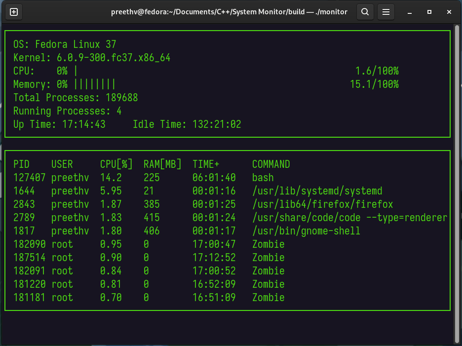

# System Monitor

This is my submission for the Linux System Monitor project for Course 2 of the [Udacity C++ Nanodegree Program](https://www.udacity.com/course/c-plus-plus-nanodegree--nd213)

This project was built and tested on Fedora, and is only meant to run on Linux systems as per the project prompt.

## ncurses
[ncurses](https://www.gnu.org/software/ncurses/) is a library that facilitates text-based graphical output in the terminal. This project relies on ncurses for display output.

If you are not using the Workspace, install ncurses within your own Linux environment: 

On Debian/Ubuntu: `sudo apt install libncurses5-dev libncursesw5-dev`
On RHEL/CentOS/Fedora (newer versions should have it installed already): `sudo dnf install libcurses-devel`

## Make
This project uses [Make](https://www.gnu.org/software/make/). The Makefile has four targets:
* `build` compiles the source code and generates an executable
* `format` applies [ClangFormat](https://clang.llvm.org/docs/ClangFormat.html) to style the source code
* `debug` compiles the source code and generates an executable, including debugging symbols
* `clean` deletes the `build/` directory, including all of the build artifacts
